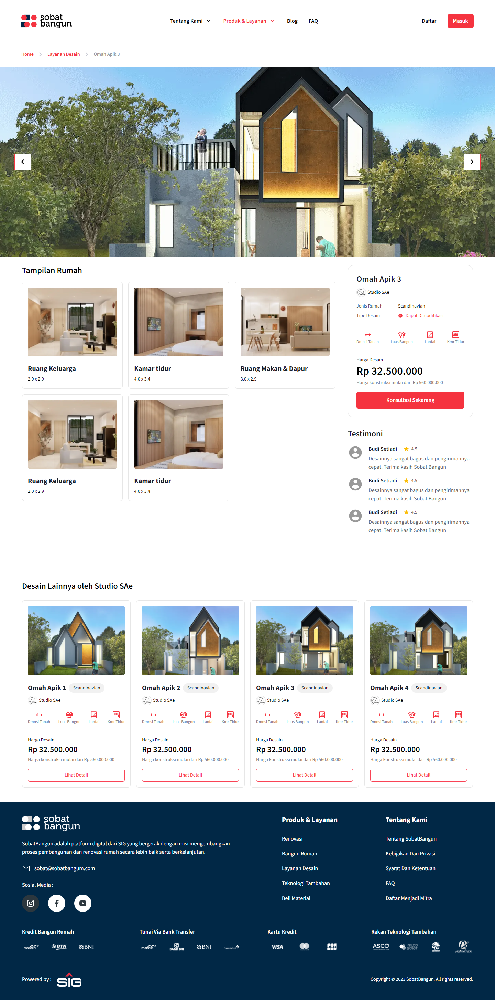
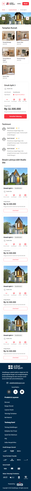

# Test DOT Indonesia

Proyek aplikasi web hasil slicing dari desain milik DOT Indonesia.\
**Demo:** https://test-dot-haris.vercel.app

## Table of Contents

- [Screen](#screen)
- [Stack](#stack)
- [Prerequisites](#prerequisites)
- [Installation](#installation)
- [Usage](#usage)
- [License](#license)

## Screen

|                                 Desktop                                 |                                Mobile                                |
| :---------------------------------------------------------------------: | :------------------------------------------------------------------: |
|  |  |

## Stack

- **Next.js:** Framework
- **React:** Library
- **Tailwind:** CSS framework
- **Source Sans Pro:** Fonts
- **Iconify:** Icon pack

## Prerequisites

Pastikan komputer sudah terinstal software berikut:

- **[Node.js](https://nodejs.org/en/download)**: versi 20 atau lebih tinggi.

## Installation

1. Unduh proyek ke komputer

```
git clone https://gitlab.com/test-dot/hrswhdn/test-dot.git
```

2. Buka folder dan instal dependency proyek

```
cd test-dot
npm install
```

## Usage

1. Jalankan dalam mode development

```
npm run dev
```

## License

Proyek ini dilisensikan di bawah Lisensi MIT - [LICENSE.md](LICENSE.md).
